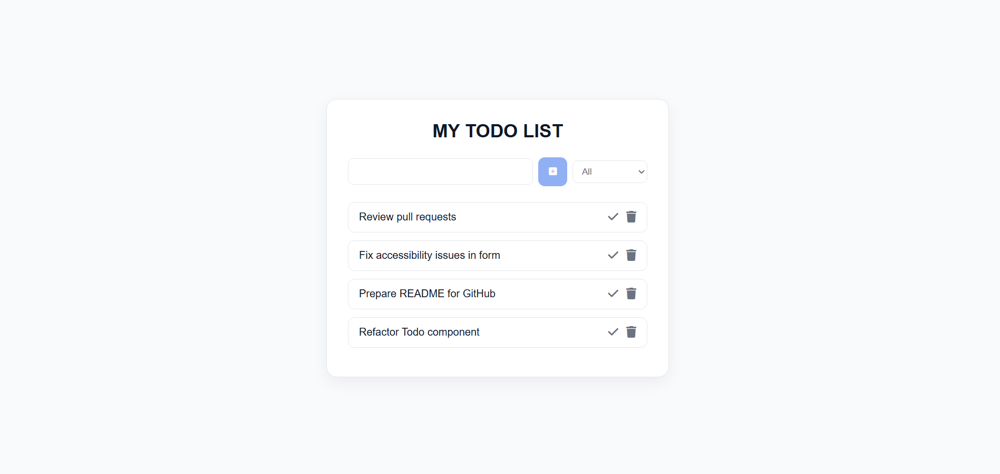
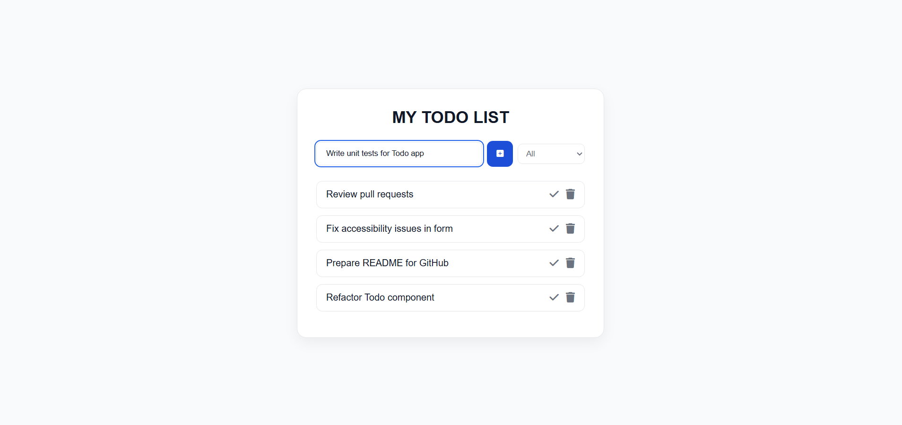
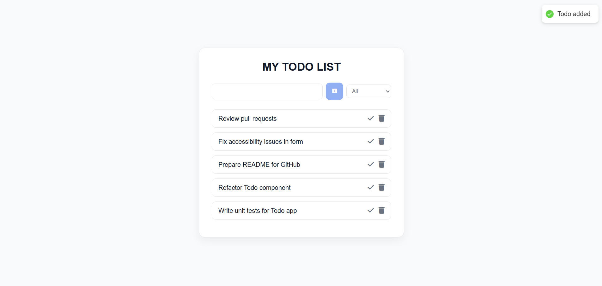
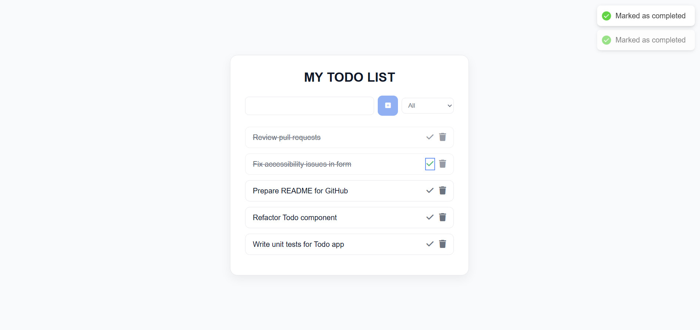
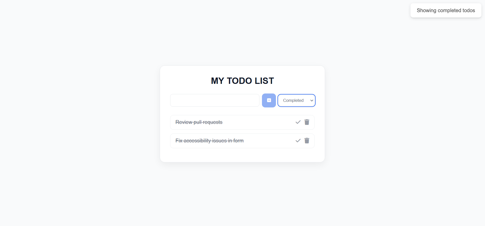
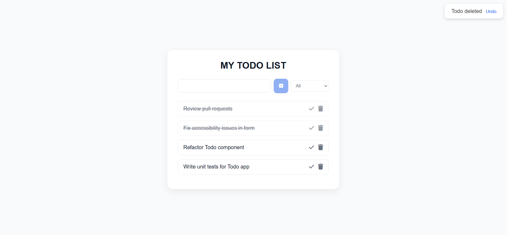
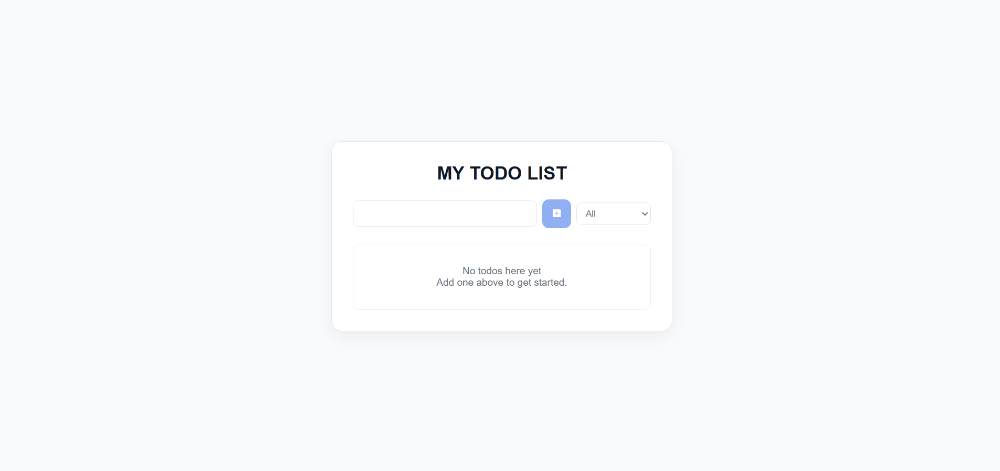

# React Todo App (Accessible & UX-focused)

A clean and accessible Todo List application built with React.  
This project focuses on **usability, accessibility (WCAG best practices)**, and **real-world UX patterns**, not just basic CRUD functionality.

---

## ✨ Features
- Add, complete, and delete todos
- Filter todos by All / Completed / Incomplete
- Persistent data using localStorage
- Undo delete functionality
- Scrollable todo list for large datasets
- Clean and responsive light-theme UI

---

## ♿ Accessibility Highlights
- Semantic HTML structure
- Skip to main content link for keyboard users
- Visible focus indicators
- Screen-reader–friendly labels
- Keyboard-accessible interactions
- Proper use of ARIA (only where necessary)

---

## 🛠 Tech Stack
- React (Functional Components & Hooks)
- CSS (custom, no UI library)
- react-hot-toast
- LocalStorage

---

## 📸 Screenshots

### Main View


### Add Todo


### Add Todo Feedback


### Completed State


### Filtered View


### Undo Delete


### Empty State


---

## ▶️ Run Locally

Clone the repository:

```bash
git clone https://github.com/MamathaBaiS/react-todo-app.git
```

Navigate to the project folder:

```bash
cd react-todo-app
```

Install dependencies:

```bash
npm install
```

Start the development server:

```bash
npm start
```

The app will be available at `http://localhost:3000`.

